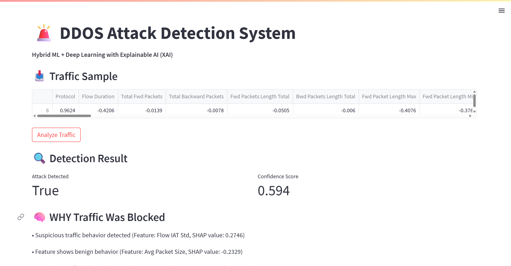
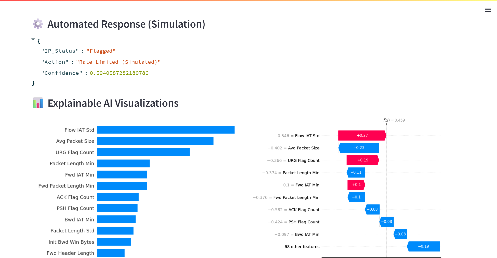
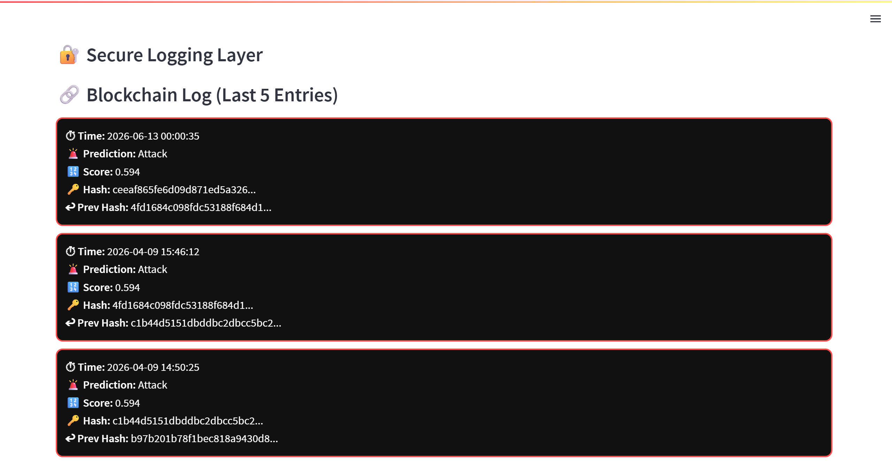

## AI-Driven DDoS Detection System with Explainable AI (XAI)

An advanced, end-to-end Machine Learning pipeline designed to detect, explain, and simulate responses to Distributed Denial of Service (DDoS) attacks. 

This project goes beyond simple classification by utilizing a **Hybrid Ensemble Model** (combining Deep Learning and Traditional ML) and solving the "Black Box" problem of AI using **SHAP (SHapley Additive exPlanations)** to provide transparent, human-readable reasons for every security block.

## Key Features

* **Hybrid AI Engine:** Combines the sequential pattern recognition of **LSTM (TensorFlow/Keras)** with the lightning-fast tabular classification of **XGBoost** to achieve highly accurate threat detection.
* **Explainable AI (XAI):** Utilizes SHAP to generate visual waterfall and bar plots, explaining exactly *which* network features (e.g., Packet Size, Flow Duration) triggered an alert.
* **Automated Response Simulation:** Translates AI confidence scores into actionable security measures (e.g., Rate Limiting, IP Flagging) ready to be digested by a firewall.
* **Interactive Dashboard:** A sleek, real-time user interface built with **Streamlit** for security analysts to monitor traffic, view AI confidence scores, and analyze SHAP visualizations.
* **Blockchain Logging:** Logs detection events and responses to a blockchain for immutable audit trails.
* **Simulation & Testing:** Includes tools for simulating DDoS attacks and testing the detection system.
* **Hardware Integration:** Arduino code for potential hardware-based monitoring or response.

## Project Architecture

```text
├── dataset/
│   ├── captured/            # Captured and processed datasets
│   ├── processed/           # Cleaned, normalized, and scaled traffic data
│   └── raw/                 # Original CICIDS2017 & CICDDoS2019 datasets
├── models/
│   └── lstm_model.h5        # Trained Deep Learning model
├── shap_outputs/            # Auto-generated Explainable AI visualizations
├── src/
│   ├── data_preprocessing.py # Data cleaning and feature scaling (StandardScaler)
│   ├── train_lstm.py         # LSTM neural network training script
│   ├── train_xgboost.py      # XGBoost decision tree ensemble training script
│   ├── hybrid_detector.py    # Weighted ensemble voting logic
│   ├── explainability.py     # SHAP tree explainer and plot generation
│   ├── response_simulator.py # Business logic for simulated firewall actions
│   └── test_simulator.py     # Simulation and testing tools
├── arduino_code/            # Arduino integration code
├── app.py                    # Terminal-based execution pipeline
├── blockchain_log.py         # Blockchain logging functionality
├── dashboard.py              # Streamlit graphical user interface
├── blockchain_log.json       # Blockchain log data
├── simulation_results.csv    # Results from simulations
├── requirements.txt          # Python dependencies
└── README.md                 # Project documentation
```

## Technologies Used
Data Processing: Python, Pandas, NumPy, Scikit-Learn

Machine Learning: XGBoost, TensorFlow (Keras)

Explainability: SHAP, Matplotlib

Frontend Dashboard: Streamlit

Blockchain: Custom logging implementation

Hardware: Arduino

## Getting Started
1. Clone the Repository
   ```bash
   git clone https://github.com/yourusername/ddos-hybrid-detector.git
   cd ddos-hybrid-detector
   ```
2. Set Up a Virtual Environment (Recommended)
   ```bash
   python -m venv .venv
   source .venv/bin/activate  # On Windows use: .venv\Scripts\activate
   ```
3. Install Dependencies
   ```bash
   pip install -r requirements.txt
   ```
4. Run the Application
   - **Option A: Terminal Command Center**  
     To see a plain-text breakdown of the pipeline processing a single packet:
     ```bash
     python app.py
     ```
   - **Option B: Launch the Interactive Dashboard (Recommended)**  
     To launch the Streamlit UI and view the SHAP visual outputs:
     ```bash
     streamlit run dashboard.py
     ```
   - **Option C: Run Simulations**  
     To test the system with simulated attacks:
     ```bash
     python src/test_simulator.py
     ```

## How the Hybrid Model Works
The core detection logic (src/hybrid_detector.py) takes a live sample of network traffic and feeds it to both the LSTM and XGBoost models. A weighted average is applied to their probability outputs (e.g., 60% XGBoost, 40% LSTM). If the final hybrid score exceeds 0.5 (50%), the traffic is flagged as a DDoS attack, triggering the SHAP explainer and the response simulator.

## Blockchain Integration
Detection events are logged to `blockchain_log.json` using `blockchain_log.py` for immutable records.

## Simulation and Testing
Use `src/test_simulator.py` to simulate DDoS scenarios and evaluate the system's performance. Results are saved to `simulation_results.csv`.

## Output Screenshots

### 1. Prediction and Explanation Dashboard



*Dashboard displaying attack predictions, confidence scores, and AI-generated explanations for detected network traffic.*

---

### 2. SHAP Values Dashboard



*Interactive SHAP visualizations highlighting the most influential features contributing to each DDoS detection decision.*

---

### 3. Blockchain Log Dashboard



*Immutable blockchain-based audit log showing recorded detection events, timestamps, and simulated mitigation actions.*

---
